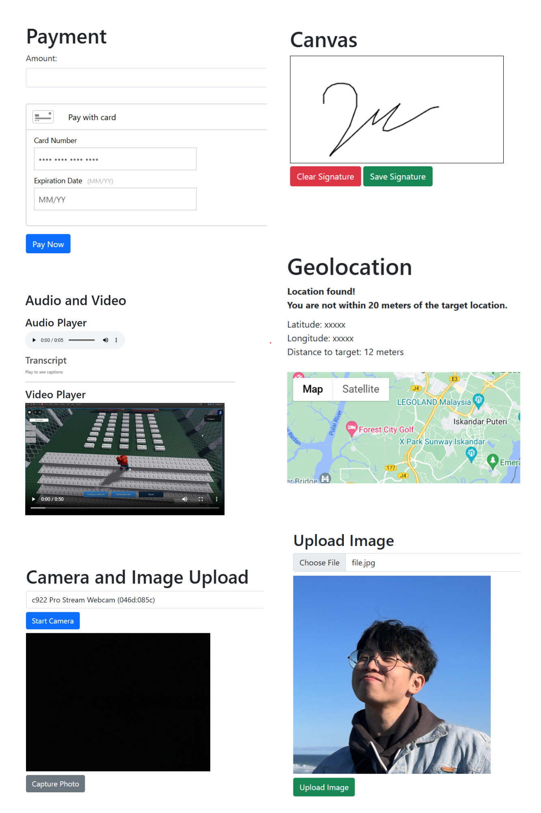

# Web Functions

A .NET 8 application that includes a set of basic functions that can be used to interact with clients from the web.

// checkboxes checked
- [x] Canvas
- [x] Camera
- [x] Audio & Video
- [x] Geolocation
- [x] Payments

